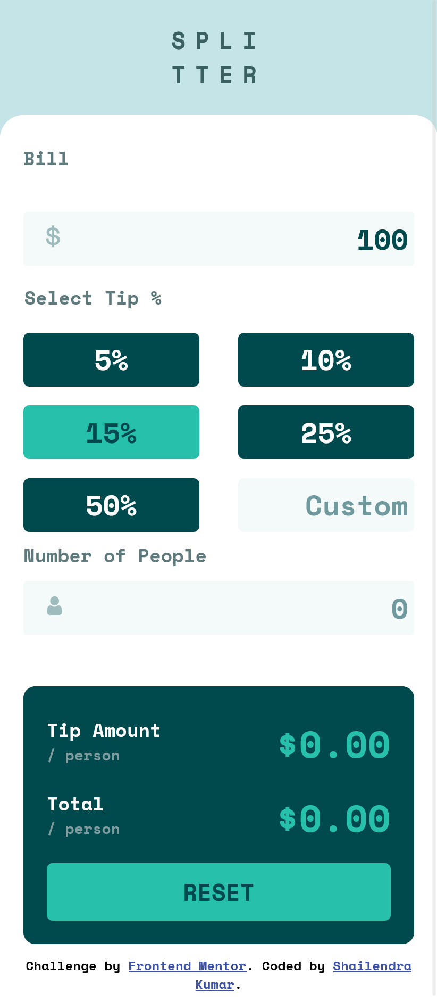

## Table of contents

- [Overview](#overview)
  - [The challenge](#the-challenge)
  - [Screenshot](#screenshot)
  - [Links](#links)
- [My process](#my-process)
  - [Built with](#built-with)
  - [What I learned](#what-i-learned)
  - [Some of the changes I made from Original Sample Design](#Some-of-the-changes-I-made-from-Original-Sample-Design)
  - [Useful resources](#useful-resources)
- [Author](#author)
- [Acknowledgments](#acknowledgments)

**Note: Delete this note and update the table of contents based on what sections you keep.**

## Overview

### The challenge

Users should be able to:

- View the optimal layout for the app depending on the device's screen size
- See hover states for all interactive elements on the page
- Calculate the correct tip and total cost of the bill per person

### Screenshot




### Links

- Solution URL: [See Github Repository](https://github.com/softwaredev-sk/tip-calculator)
- Live Site URL: [See Live Here](http://tip-calculator-sk.vercel.app/)

## My process

### Built with

- HTML5 markup
- CSS
- Flexbox
- Mobile-first workflow

### What I learned

- This project helped me the implementation of flexbox and how to use flexbox by nesting one inside another
- This project helped me learn when and how to add css classes dynamically and when it is good to use any class name by default
- This project helped me learn DOM manipulation using JavaScript to calculate and update form in real-time
- Learn how to structure an webpage in HTML so that later CSS can be applied to give desired layout.
- Learned how CSS can be used to exclude any property for certain state such as disabled button
- Learnt different types of Event Handlers

```css
.reset-btn:hover:not([disabled]) {
  filter: brightness(90%);
}
```

### Some of the changes I made from Original Sample Design

- I made to page load with default tip percentage, i.e. 15%
- Used eyedropper for selecting orange color for error "Can't be zero" from sample image, so the color is not exactly same due to image showing pixelated.
- Due to hover color and reset button color being same, I used filter option to manipulate brightness, to make hover effect different.

### Useful resources

- [MDN Flexbox](https://developer.mozilla.org/en-US/docs/Learn/CSS/CSS_layout/Flexbox) - Learn different properties of flex.
- [Media Queries](https://developer.mozilla.org/en-US/docs/Web/CSS/@media) - Learned how media queries can be implemented for different device sizes to make an adaptive design

## Author

- Website - [Shailendra Kumar](https://www.shailendra.xyz)
- Frontend Mentor - [@develover-sk](https://www.frontendmentor.io/profile/softwaredev-sk)
- Twitter - [@shailendrakrsk\_](https://www.twitter.com/shailendrakrsk_)

## Acknowledgments

A special thanks to Frontend Mentor for providing with design ideas to practice coding. Challenges from frontend mentor are helping me to practice and grow frontend development journey, in a structured way.
